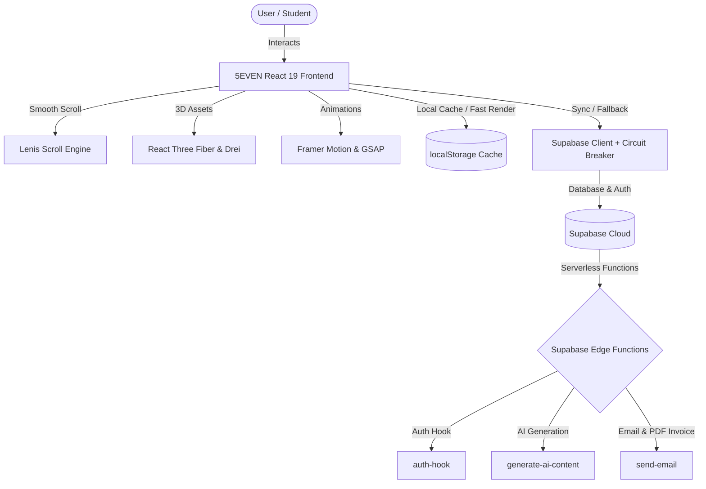

# 🏛️ 5EVEN Institution — Digital Portal
> **Ancient Wisdom Meets Modern Innovation. A Weightless, Zero-Lag Institutional Ecosystem.**

[](https://react.dev)
[](https://vitejs.dev)
[](https://supabase.com)
[](https://tailwindcss.com)
[](https://www.framer.com/motion/)
[](https://threejs.org/)

---

## 🔮 The 5EVEN Philosophy & Overview

**5EVEN Institution** is an elite student portal and content distribution platform designed to redefine education. The portal's philosophy lies at the synergy of ancient wisdom and modern technology:

*   **5 Elements:** The foundation of all knowledge and systems (Earth, Water, Fire, Air, Space).
*   **7 Chakras:** The alignment of energy centers and intellectual milestones.
*   **Divine Union:** Redefining academic structure, courses, research development, and professional services with modular excellence.

The system is built on a **Zero-Lag Architecture** (<100ms perceived latency) utilizing React 19 concurrent rendering, local caching, and a resilient database circuit breaker.

---

## ✨ Features & Architecture



### 1. 🎓 Study Desk & Academic Tracks
*   **Mastery Programs:** Browse structured course curriculums with multi-section modules.
*   **Study Desk (Notes):** Instant rendering of study notes, with native PDF preview support via `react-pdf`.
*   **Final Certification Exams:** Integrated exams to evaluate student competency and generate certificates.

### 2. ⚡ Student Zone (Personalized Dashboard)
*   **Multi-Step Operative Onboarding:** Sleek four-step signup sequence (`Identity` ➔ `Access` ➔ `Track` ➔ `Specialty`).
*   **Rich Profile Customization:** Custom avatars, banner overlays, biographical summaries, educational history, and platform platforms.
*   **Signature Sharing:** Signature generator and sharing tool to sign certificates and profiles.
*   **Dynamic Billing & Invoices:** Instant PDF invoices generated in-browser using `html2canvas` and `jspdf` for all transactions.

### 3. 📝 Peer-Reviewed Student Submissions
*   Students can submit projects, research papers, and technical insights.
*   Includes draft saving, file uploading directly to Supabase storage, and an review lifecycle status (`on_hold` ➔ `approved`/`rejected`).

### 4. 🎛️ Conti CMS (Content Management)
*   A decoupled management interface for creators, faculty, and admins to publish lessons, attach media files (videos, pdf, subtitle files), and order courses.
*   Integrated verified exam endpoints and asset upload queues.

### 5. 👑 SevenMod (Centralized Admin Operations)
*   **Analytics Dashboard:** Responsive, interactive charting (Line, Bar, Area, Pie charts via `recharts`) showing active users, revenues, and resource consumption over configurable timeframes.
*   **Role Management:** Change user permissions (`student`, `faculty`, `admin`, `visionary`, `founder`).
*   **Identity Synchronization:** Automatic backfill of serial ID cards (`70326-[TYPE]-[SERIAL]`) across all databases.
*   **Coupon Code System:** Full coupon control panel with discount percentages, minimum spending amounts, expiry trackers, and use limit restrictions.
*   **Submission Moderation:** One-click publishing approval dashboard.

### 6. 🛠️ Developer Portal
*   Integrate third-party services using 5EVEN identity credentials.
*   Exposes endpoints for OAuth 2.1 authorization, PKCE token exchange, public JWKS configurations, and OIDC discovery manifests.

---

## 🛠️ Technology Stack & Dependencies

| Layer | Technology | Details |
| :--- | :--- | :--- |
| **Frontend UI** | **React 19 & Vite** | SWC compilers, React Router Dom 7, Concurrent Rendering. |
| **Styling & FX** | **Tailwind CSS & Lucide Icons** | Version 4.2.2 with native animations. |
| **Animations** | **GSAP & Framer Motion** | Micro-interactions, spring transitions, scrolling perspectives. |
| **3D Rendering** | **Three.js / React Three Fiber** | Custom 3D backgrounds and assets. |
| **Database & Auth** | **Supabase** | Real-time Postgres database, Edge Functions, OAuth 2.1, Row Level Security. |
| **Scroll Engine** | **Lenis** | Smooth momentum scrolling. |
| **Document/Media** | **PDF.js, Plyr, html2canvas, jsPDF** | High fidelity media players and certificate generators. |
| **Visual Analytics**| **Recharts** | Real-time statistics reporting. |

---

## 📈 Resiliency & Circuit Breaker Pattern

To maintain the global standard of a weightless experience, the frontend implements a custom database **circuit breaker**:

```javascript
// From DataContext.jsx
try {
  const results = await withTimeout(
    Promise.all([ ...fetchTasks ]),
    15000,
    'Global data fetch timed out.'
  );
  // ... success caching logic
} catch (err) {
  if (retryCount < 2) {
    setTimeout(() => fetchAllData(retryCount + 1), 2000);
  } else {
    const hasCache = localStorage.getItem('seven_cache_timestamp');
    if (hasCache) {
      console.warn('Circuit breaker active: Sync failed. Falling back to local cache.');
      // App functions instantly with previous cached state
    }
  }
}
```

---

## 📂 Project Structure

```
├── .env.local                  # Local system environment variables
├── package.json                # Project configurations & dependency versions
├── vite.config.mjs             # Vite build & plugin configurations
├── tailwind.config.js          # Tailwind CSS presets & styling guides
├── netlify.toml                # Netlify SPA redirect configurations
├── supabase/                   # Supabase backend files
│   ├── config.toml             # Local emulation settings
│   └── functions/              # Edge serverless functions
│       ├── auth-hook/          # Auth lifecycle hook
│       ├── generate-ai-content/# Gemini-powered Vertex AI endpoints
│       └── send-email/         # Resend-based transactional emailing
└── src/                        # React Application Source
    ├── assets/                 # SVGs, icons, and logos
    ├── components/             # Reusable UI widgets (TiltCard, CustomCursor, etc.)
    ├── context/                # Global contexts (Auth, Theme, Data, Alert)
    ├── hooks/                  # Custom React hooks
    ├── lib/                    # Supabase client, Invoice Generator, SEO updater
    ├── pages/                  # Route layouts (Home, StudentZone, SevenMod, etc.)
    └── utils/                  # Miscellaneous utility methods
```

---

## 🚀 Getting Started

### Prerequisites
*   Node.js v18+
*   npm or yarn
*   Supabase CLI (optional, for local edge function development)

### Installation
1. Clone the repository:
   ```bash
   git clone https://github.com/your-username/seven.git
   cd seven
   ```

2. Install dependencies:
   ```bash
   npm install
   ```

3. Set up your environment variables:
   Create a `.env.local` file in the root directory:
   ```env
   VITE_SUPABASE_URL=https://your-project-id.supabase.co
   VITE_SUPABASE_ANON_KEY=your-anonymous-key
   ```

4. Start the zero-lag local development server:
   ```bash
   npm run dev
   ```

5. Build for production:
   ```bash
   npm run build
   ```

---

## 🏷️ Release Notes: V 1.0.0 (Initial Public Release)

We are proud to announce the official release of **5EVEN Portal v1.0.0**! This milestone delivers a comprehensive, zero-lag, resilient institutional environment.

### Key Release Highlights:

*   **⚡ Zero-Lag Client Interface:** Fully structured with React 19 and Vite 6, incorporating Lenis smooth scrolling and Framer Motion transitions. Perceived latencies are maintained below 100ms.
*   **🛡️ Robust Database Architecture:** Built on top of Supabase with customized retry logic, parallelized queries, and an automatic cache circuit breaker that preserves full accessibility during database or network drops.
*   **👤 Student Creative Hub (Student Zone):** 
    *   Sleek signup funnel containing identity, email security, tracking, and sub-track specialties.
    *   Public profiles and bio showcases with custom signature generation.
    *   Submission dashboard to publish documents, articles, or projects.
*   **💳 Payment Gateway & Digital Invoicing:** Secured credit/UPI gateway integrated with custom Slice Bank endpoints. Includes automatic client-side PDF Invoice generation containing detailed transaction IDs and billing records.
*   **📺 High-Fidelity Course Player:** Custom custom Plyr video player with subtitle uploads and integrated note viewers.
*   **👑 Full-Scale Admin Console (SevenMod):**
    *   Graphical analysis engine powered by Recharts, offering dynamic interval views (Daily, Weekly, Monthly, Quarterly, Lifetime).
    *   Coupon management panel to deploy and track platform promotional codes.
    *   Account moderation console for students, faculty, and content structures.
*   **📈 Serverless Backend Ecosystem:** Production-ready Supabase Edge Functions for handling email alerts, automated billing invoices, and automated content configurations.

---

*Developed by the 5EVEN Developer Team.*
